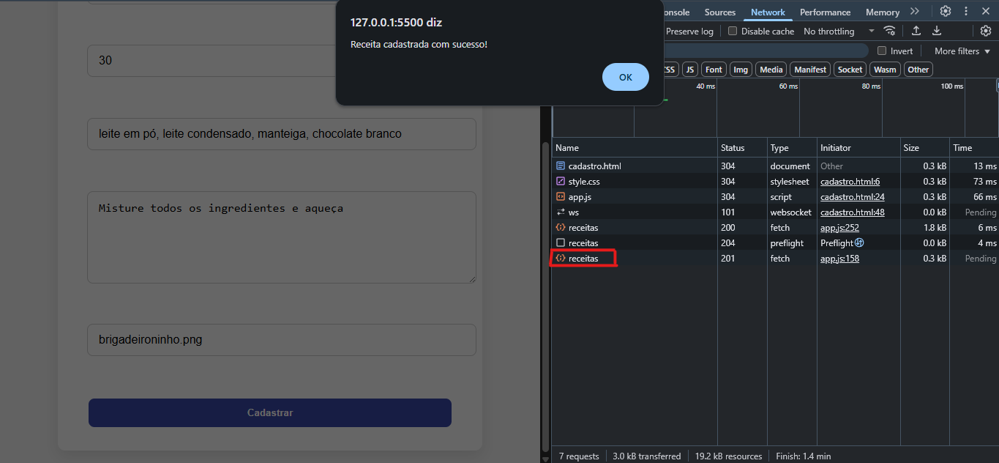

# 🍽️ **Trabalho Prático - Semana 12 | Site de Receitas**

* **👤 Nome:** Pedro Augusto Niess Ferreira
* **🆔 Matrícula:** 1540911
* **📚 Proposta de projeto escolhida:** Site de Receitas
* **📝 Descrição:**
  Este projeto é um **site de receitas** onde os usuários podem explorar, cadastrar, editar, visualizar detalhes e remover receitas culinárias. A aplicação conta com uma API simulada utilizando **JSON Server** e um front-end construído em HTML, CSS e JavaScript puro.

---

## 🚀 **Funcionalidades do Projeto**

* 📜 **Página inicial (`index.html`)** com cards dinâmicos mostrando imagem, nome e descrição das receitas.
* 🔍 **Página de detalhes (`detalhes.html`)** que exibe informações completas, incluindo lista de ingredientes e modo de preparo.
* 🗂️ **Página administrativa (`admin.html`)** com uma tabela para gerenciar as receitas (listar, editar, excluir).
* ➕ **Página de cadastro (`cadastro.html`)** para adicionar novas receitas.
* ✏️ **Página de edição (`edit.html`)** para alterar dados de uma receita existente.
* 📦 Backend simulado com **JSON Server**, permitindo operações completas de **CRUD**.

---

## ⚙️ **Tecnologias Utilizadas**

* HTML5
* CSS3
* JavaScript (ES6)
* JSON Server (para simulação de API REST)
* Thunder Client / Postman / Insomnia (para testes da API)

---

## 🏗️ **Como Executar o Projeto Localmente**

### 🔸 Pré-requisitos:

* Node.js instalado na máquina.

### 🔸 Instalação do JSON Server:

```bash
npm install -g json-server
```

### 🔸 Executar o backend (JSON Server):

```bash
json-server --watch db/db.json --port 3000
```

### 🔸 Acessar as páginas:

* Página inicial: `index.html`
* Admin (tabela CRUD): `admin.html`
* Cadastro: `cadastro.html`
* Edição: `edit.html`
* Detalhes: acessado via card na página inicial.

---

## 🔗 **Estrutura dos Endpoints da API**

| Método | Endpoint         | Descrição                      |
| ------ | ---------------- | ------------------------------ |
| GET    | `/receitas`      | Lista todas as receitas        |
| GET    | `/receitas/{id}` | Busca uma receita específica   |
| POST   | `/receitas`      | Cria uma nova receita          |
| PUT    | `/receitas/{id}` | Atualiza uma receita existente |
| DELETE | `/receitas/{id}` | Remove uma receita da base     |

---

## ✅ **Etapa de Testes da API**

Foram realizados testes completos na API utilizando o **Thunder Client / Postman / Insomnia**, cobrindo todos os métodos CRUD.

---

### 🔍 **GET - Buscar todas as receitas**

* ✅ Retorna todas as receitas cadastradas no banco de dados JSON.
* Endpoint utilizado:

```
GET http://localhost:3000/receitas
```


---

### 🔍 **GET - Buscar receita por ID**

* ✅ Retorna os detalhes de uma receita específica usando seu ID.
* Exemplo de endpoint:

```
GET http://localhost:3000/receitas/1
```

---

### ➕ **POST - Cadastrar uma nova receita**

* ✅ Cria uma nova receita na base de dados.
* Endpoint utilizado:

```
POST http://localhost:3000/receitas
```

* Body enviado no formato JSON:

```json
{
  "nome": "Nome da Receita",
  "descricao": "Descrição da receita",
  "tempoPreparo": "40 minutos",
  "ingredientes": ["item1", "item2"],
  "modoPreparo": ["passo 1", "passo 2"],
  "imagem": "nomeImagem.png"
}
```


---

### ✏️ **PUT - Atualizar uma receita existente**

* ✅ Atualiza completamente os dados de uma receita.
* Endpoint utilizado:

```
PUT http://localhost:3000/receitas/1
```

* Body enviado no formato JSON (dados atualizados).


---

### 🗑️ **DELETE - Remover uma receita**

* ✅ Remove uma receita da base de dados usando o ID.
* Endpoint utilizado:

```
DELETE http://localhost:3000/receitas/1
```


---

### 🔗 **Cadastro de Receitas via Front-End**

* ✅ Além do cadastro manual via requisições REST, o projeto permite cadastrar receitas diretamente pela interface gráfica do site, utilizando Fetch API no JavaScript.



---

## 🏆 **Status do Projeto**

* ✅ Funcional.
* ✅ CRUD completo.
* ✅ Testado via API externa (Thunder Client/Postman) e via front-end.
* 🚀 Pode ser expandido futuramente para:

  * Upload real de imagens.
  * Filtros de busca por tipo de receita.
  * Integração com banco de dados real e backend com Node/Express.

---

## 👨‍💻 **Desenvolvido por:**

**Pedro Augusto Niess Ferreira**
📅 PUC Minas - Semana 12

