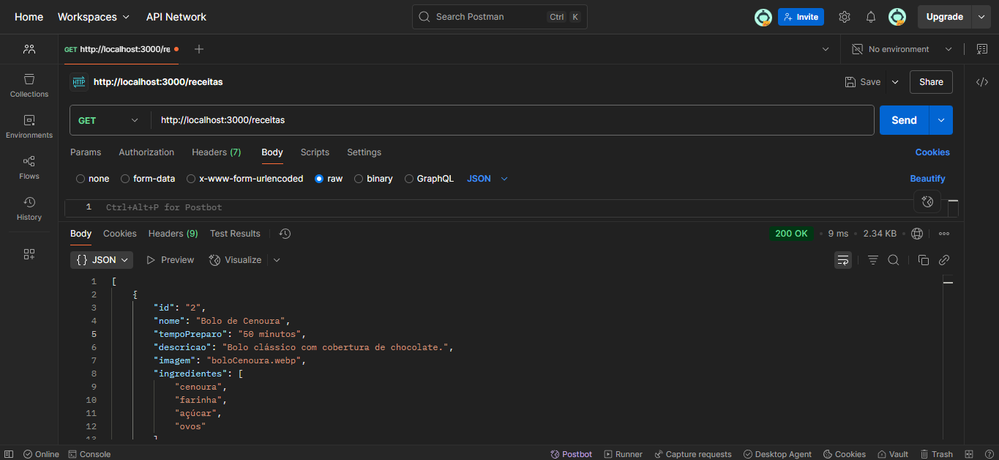
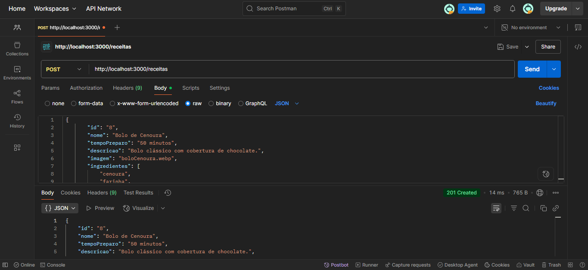
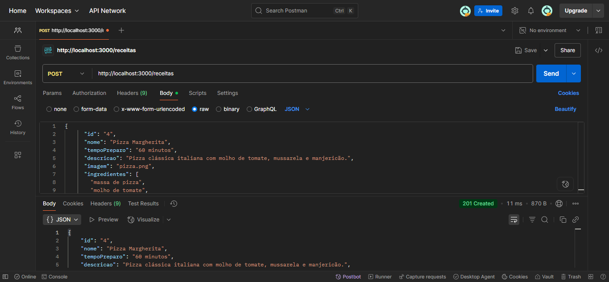
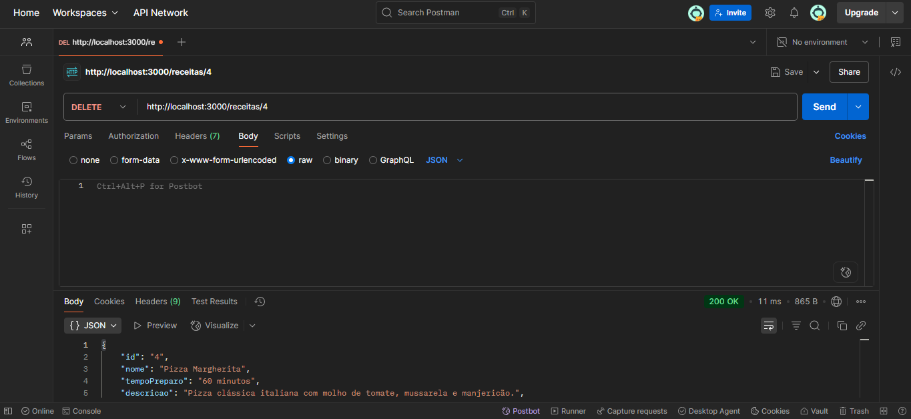

# Trabalho Prático - Semana 12

- **Nome:** Pedro Augusto Niess Ferreira  
- **Matrícula:** 1540911  
- **Proposta de projeto escolhida:** Site de Receitas  
- **Breve descrição do projeto:**  
  Este projeto é um site de receitas onde os usuários podem explorar uma lista de pratos. A página inicial exibe receitas em cards dinâmicos, com imagem, nome e descrição. Ao clicar em uma receita, o usuário é direcionado à página de detalhes, contendo informações completas sobre ingredientes e preparo.

---

### ✅ Etapa de testes da API

Foram realizados testes completos na API utilizando o [Postman/Thunder Client/Insomnia] para validar as operações de **CRUD (Create, Read, Update, Delete)** da entidade `receitas` do projeto.

Cada requisição foi testada e validada, conforme descrito abaixo:

---

#### 🔍 **GET - Buscar todas as receitas**

- Retorna todas as receitas cadastradas na API em formato JSON.
- Endpoint utilizado: `GET http://localhost:3000/receitas`

---

#### 🔍 **GET - Buscar receita por ID**

- Retorna os detalhes de uma receita específica utilizando seu ID.
- Exemplo de endpoint: `GET http://localhost:3000/receitas/1`

*(Opcional: inserir print se desejar)*

---

#### ➕ **POST - Cadastrar uma nova receita**

- Permite adicionar uma nova receita na base de dados.
- Endpoint utilizado: `POST http://localhost:3000/receitas`
- Body enviado no formato JSON, contendo informações como nome, descrição, ingredientes, modo de preparo e imagem.

---

#### ✏️ **PUT - Atualizar uma receita existente**

- Realiza a atualização completa de uma receita existente através de seu ID.
- Endpoint utilizado: `PUT http://localhost:3000/receitas/1`
- Body com os dados atualizados no formato JSON.

---

#### 🗑️ **DELETE - Remover uma receita**

- Remove uma receita existente da base de dados usando seu ID.
- Endpoint utilizado: `DELETE http://localhost:3000/receitas/1`

---

Todos os testes foram realizados com sucesso, garantindo o funcionamento correto da API RESTful construída com JSON Server.
