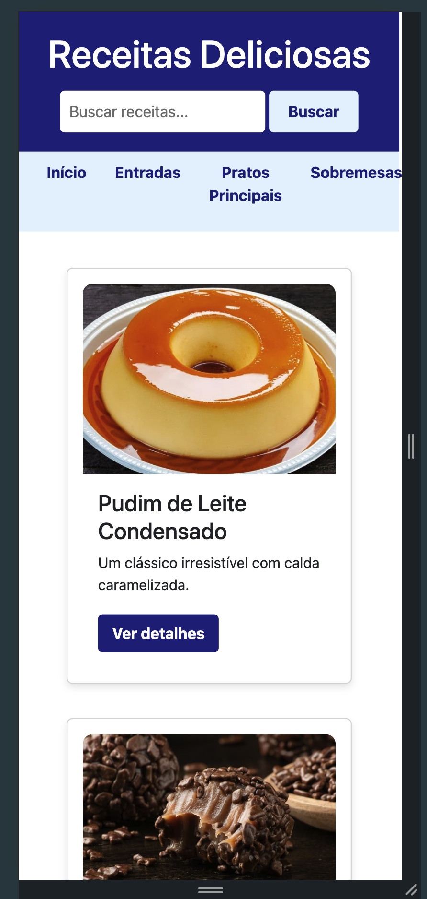
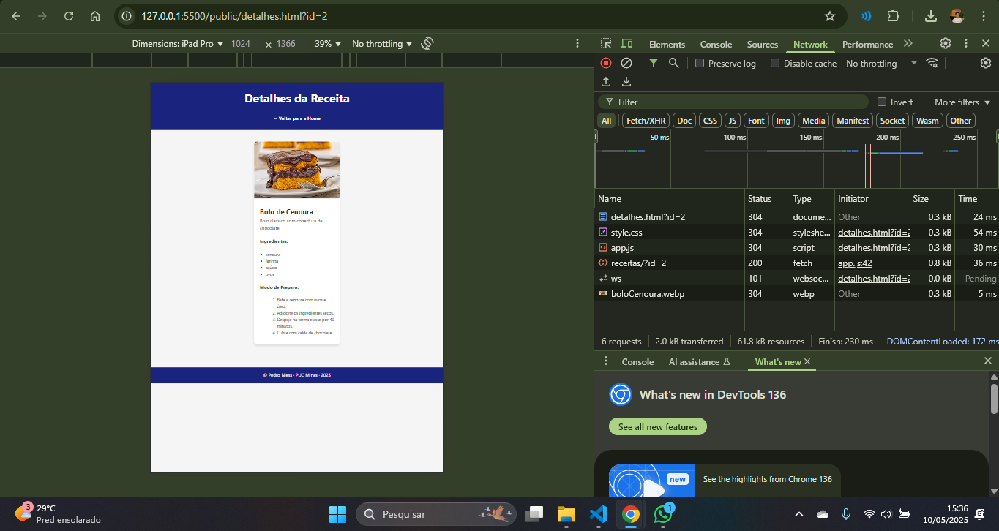
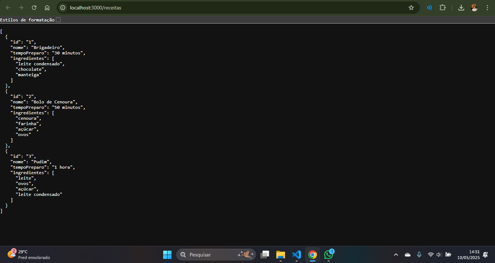

# Trabalho Prático - Semana 11 

**Páginas de detalhes dinâmicas**

Nessa etapa, vamos evoluir o trabalho anterior, acrescentando a página de detalhes, conforme o projeto escolhido. Imagine que a página principal (home-page) mostre uma visão dos vários itens que existem no seu site. Ao clicar em um item, você é direcionado para a página de detalhes. A página de detalhe vai mostrar todas as informações sobre o item do seu projeto – seja esse item uma notícia, filme, receita, lugar turístico ou evento.

---

## Informações Gerais

- **Nome:** Pedro Augusto Niess Ferreira  
- **Matrícula:** 1540911  
- **Proposta de projeto escolhida:** Site de Receitas  
- **Breve descrição do projeto:**  
  Este projeto é um site de receitas onde os usuários podem explorar uma lista de pratos. A página inicial exibe receitas em cards dinâmicos, com imagem, nome e descrição. Ao clicar em uma receita, o usuário é direcionado à página de detalhes, contendo informações completas sobre ingredientes e preparo.

---

## Etapa 1 – Responsividade com CSS puro

### ✅ Print da versão responsiva com CSS



---

## Etapa 2 – Montagem da Estrutura de Dados e Teste da API com JSON Server

A API da aplicação foi criada com o uso do **JSON Server**, utilizando um arquivo `db.json` com uma estrutura de dados representando receitas.



### ✅ Estrutura inserida no `db.json`:



```json
{
  "receitas": [
    {
      "id": 1,
      "nome": "Brigadeiro",
      "tempoPreparo": "30 minutos",
      "descricao": "Doce tradicional brasileiro feito com chocolate.",
      "imagem": "brigadeiro.png",
      "ingredientes": ["leite condensado", "chocolate", "manteiga"],
      "modoPreparo": ["Misture tudo", "Cozinhe até soltar do fundo"]
    },
    {
      "id": 2,
      "nome": "Bolo de Cenoura",
      "tempoPreparo": "50 minutos",
      "descricao": "Bolo clássico com cobertura de chocolate.",
      "imagem": "bolo-cenoura.png",
      "ingredientes": ["cenoura", "farinha", "açúcar", "ovos"],
      "modoPreparo": ["Bata tudo", "Asse por 40 minutos"]
    },
    {
      "id": 3,
      "nome": "Pudim",
      "tempoPreparo": "1 hora",
      "descricao": "Sobremesa tradicional com calda caramelizada.",
      "imagem": "pudim.png",
      "ingredientes": ["leite", "ovos", "açúcar", "leite condensado"],
      "modoPreparo": ["Bata no liquidificador", "Asse em banho-maria"]
    }
  ]
}
